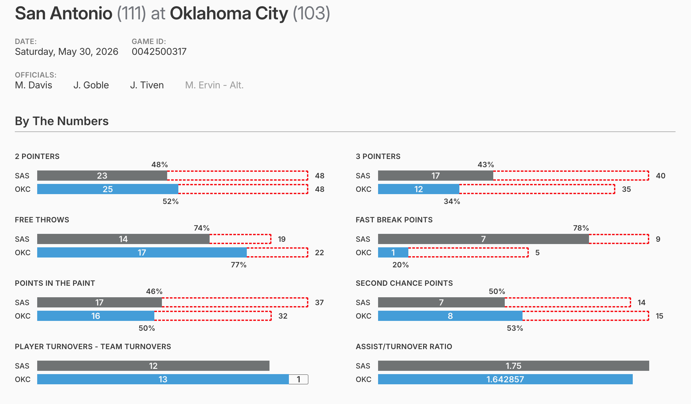
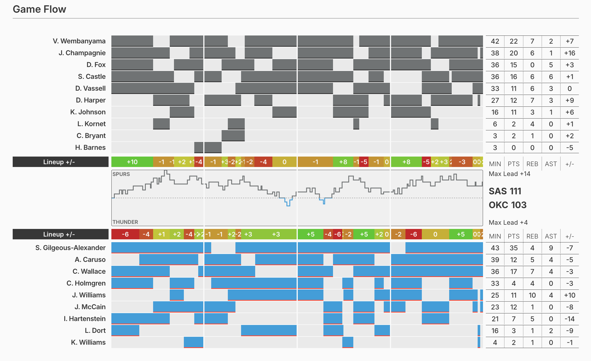
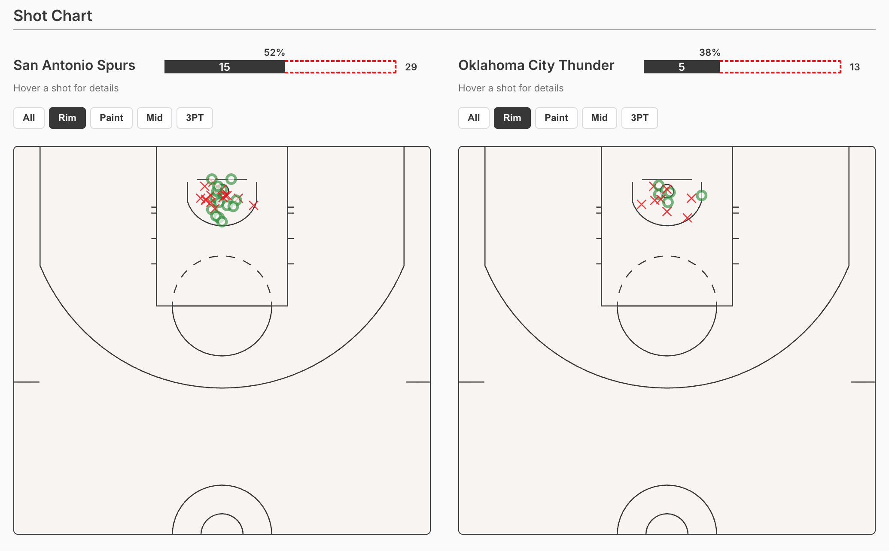

# Hoop State Gameflows 🏀

  A visual, stats-first look at NBA games — lineup rotations, score-margin trends, shot charts, and full box score.

  **[Live site →](#)** _(URL)_

   

  

     
     
    
  

  ## What's here

  Each game/page is constructed from play-by-play data:

  - **Lineup & rotation bars** — who was on the floor, when, and how they performed in that stretch
  - **Score margin chart** — lead changes over the course of the game
  - **Shot chart** — makes/misses plotted on a court, filterable by zone (rim, paint, mid-range, three)
  - **Box score** — full stat lines for both teams
  - Season browsing by date, with a compact/expanded header that responds to scroll (most recent season is available - more to be added soon)

  ## Development

  **Stack:**  Next.js (App Router) · React · TypeScript · Sass Modules · SQLite

  Game and play-by-play data is ingested into SQLite via a companion stats ingest project, then read here through [`@misterpea/sqlite-worker-db`](https://github.com/MisterPea/sqlite-worker-db), a worker-threaded SQLite client that keeps DB access off the main thread during static generation. Every game page is pre-rendered at build time — no client-side data fetching, no API layer to keep warm.
  
  Notable decisions along the way:
  - **Static generation over an API** — since the underlying data (finished games) never changes, there's no reason to serve it dynamically. Cheaper to host, faster to load.
  - **Components built and tested in Storybook, isolated from live data** — every chart/row/table (`ShotChart`, `GameFlowRow`,
  `BoxScoreTable`, etc.) is a pure presentational component driven entirely by props. Edge cases — bench player, overtime game,
  blowout margin — are authored directly as story args instead of hunting the ingest DB for a real game that happens to produce them.
  - **Player stint tracking** - Utilize the per-play data to construct a scoring/foul accumulation narrative for every player-stint. 
  - **Court and shot data rendered as inline SVG**, hand-mapped to real NBA court proportions rather than an approximate/placeholder layout.

   

  <small>**Disclaimer:** Not affiliated with the NBA. Data used for personal/educational purposes.</small>
